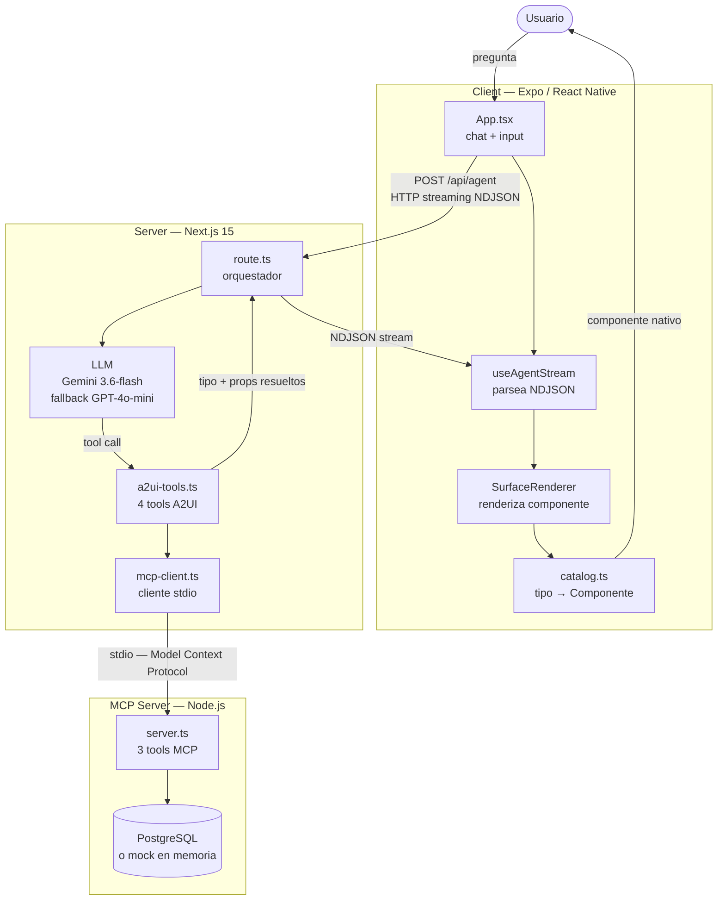

# Mosaico — Arquitectura y Decisiones Técnicas

## Diagrama de arquitectura

### Flujo de un mensaje

1. El usuario escribe una pregunta en `App.tsx`.
2. `useAgentStream` hace `POST /api/agent` y lee la respuesta en streaming línea a línea.
3. `route.ts` llama a `streamText` con el modelo y las 4 tools A2UI.
4. El modelo decide qué tool invocar (p.ej. `mostrarProgresoMeta`).
5. La tool llama al MCP → trae datos reales de Postgres (o mock si no hay `DATABASE_URL`).
6. El servidor emite una línea NDJSON: `{"type":"surface","tipo":"RastreadorMetas","props":{...}}`.
7. `SurfaceRenderer` busca `"RastreadorMetas"` en `catalog.ts` y renderiza el componente nativo con los props ya resueltos.

---

## Trade-offs: Modelo

| Dimensión | Gemini 3.6 Flash (primario) | GPT-4o Mini (respaldo) |
|---|---|---|
| Costo | Free tier (cuota baja por key) | Pay-per-use |
| Latencia | ~1–2 s streaming | ~1.5 s streaming |
| Tool calling | Soportado | Soportado |
| Estabilidad de IDs | IDs de modelo cambian — usar explícitos, no alias | Más estable |
| Rol | Primario | Fallback automático si Gemini falla antes de emitir contenido |

**Por qué esta combinación:** Gemini cubre el free tier del hackathon; si falla, OpenAI entra sin reiniciar el stream. Se descartó Claude Sonnet porque requiere key de pago y no aporta ventaja diferencial para el dominio financiero en este alcance.

**Regla operativa:** Nunca usar alias como `gemini-flash-latest` — el modelo que resuelven cambia y puede tener cuota de 20 req/día. Siempre usar IDs explícitos (`gemini-3.6-flash`).

---

## Trade-offs: Protocolo

| Dimensión | A2UI-lite — NDJSON (elegido) | RSC / streamUI | REST JSON puro |
|---|---|---|---|
| Formato | JSON declarativo `{tipo, props}` | JSX serializado (código) | JSON one-shot |
| Clientes soportados | Cualquiera: RN, web, Flutter | Solo React | Cualquiera |
| Streaming | Sí, línea a línea | Sí | No |
| Riesgo de alucinación | Bajo — LLM elige qué mostrar; datos vienen del MCP, nunca del modelo | Medio | Alto — LLM genera cifras como texto |
| Complejidad | Baja — NDJSON es texto plano | Alta — runtime RSC | Baja |

**Por qué A2UI-lite:** RSC fue el enfoque original y se descartó porque `streamUI` manda JSX (código React ya renderizado), un formato que React Native no puede interpretar. A2UI-lite manda `{tipo, props}` puro: el cliente recibe datos y renderiza con su propio catálogo de componentes nativos. Ningún JSX ni código ejecutable cruza la red.

**Subconjunto deliberado:** El protocolo aquí manda cada bloque ya resuelto de una vez (no streaming granular componente-por-componente como el A2UI completo oficial). Es suficiente para el alcance del reto y más fácil de debuggear.

---

## Trade-offs: Infraestructura

| Componente | Elegido | Alternativas consideradas | Razón |
|---|---|---|---|
| **Cliente** | Expo v57 / React Native | Next.js web, Flutter | Un codebase para web + Android + iOS; sin compilador nativo; Expo Go para demo rápido |
| **Servidor** | Next.js 15 (App Router) | Express, Fastify, Hono | Route handlers serverless-ready; streaming HTTP nativo; Vercel AI SDK integrado |
| **Transporte MCP** | stdio (proceso hijo) | HTTP/SSE | stdio = sin puerto extra en dev; cambiar a HTTP si server y MCP se despliegan por separado |
| **Base de datos financiera** | PostgreSQL (vía MCP) | MySQL, MongoDB, SQLite | MCP SDK ya lo soporta; esquema relacional natural para cuentas y transacciones |
| **Historial de chat** | SQLite local (cliente) | Postgres, no persistencia | El historial es personal y volátil — no necesita sincronizarse; si se reinstala la app, se pierde (aceptado) |
| **Modo desarrollo** | Mock en memoria (sin `DATABASE_URL`) | Siempre DB | Permite desarrollar y demo-ear UI sin Postgres corriendo; el mock implementa la misma interfaz que el MCP real |

**Decisión de persistencia clave — receta vs snapshot:** El dashboard no guarda los valores (`porcentaje: 62`) sino la receta (`{tool: "mostrarProgresoMeta", parametros: {metaId: "meta-1"}}`). Al rehidratar, el servidor ejecuta la tool con esos parámetros y trae el dato fresco. Esto evita mostrar cifras desactualizadas y elimina el riesgo de que el modelo "recuerde" un número que ya cambió.
